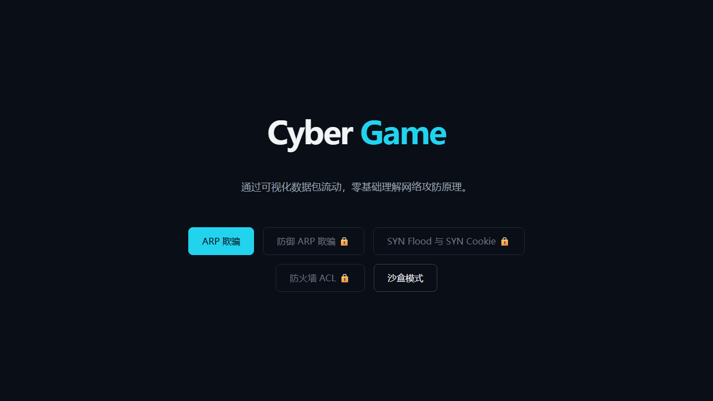
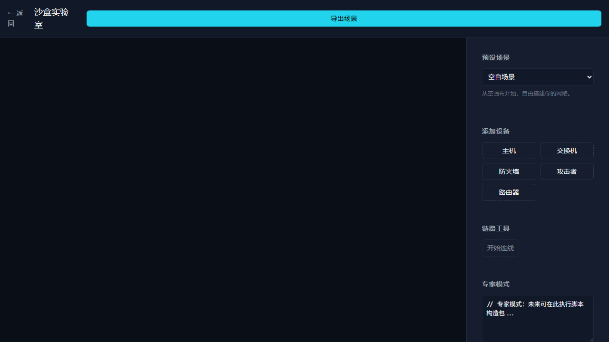

# 0010 · cyber-game M8-M9 Demo 与工具链验证

**状态**：已完成 ✅  
**日期**：2026-08-16  
**关联**：#9（发布 cyber-game M8-M9 经验包 v0.2）  
**验证人**：Claude Code 自动 + 人工复核  

## 目标

补齐 `data/samples/cyber-game-m9/verification-report.md` 中标记的待补项：

1. 用 Playwright 访问 `https://li-yongqvan.github.io/cyber-game/sandbox` 确认沙盒页面渲染。
2. 用 Playwright 访问首页确认关卡锁定/解锁状态与徽章显示。
3. 在审核 UI 原型中加载 `session-be0044d7-scrubbed.jsonl` 和 `decision-points.jsonl` 做端到端测试。
4. 人工复核 `data/samples/cyber-game-m9/.needs_review` 中的 16 个启发式会话片段锚点。

## 1. cyber-game Demo Playwright 验证

### 环境

- Playwright：1.62.1
- 浏览器：Chromium for Testing 151.0.7922.34
- 脚本：`scripts/verify-cyber-game-m9-demo.js`
- 报告：`playwright-report.json`

### 结果

| 检查项 | URL | 结果 | 关键信号 |
|---|---|---|---|
| 首页关卡与锁定/解锁 | `/` | ✅ 通过 | 标题 "Cyber Game"、沙盒模式按钮、ARP 欺骗关卡、🔒 锁定图标 |
| 沙盒页面渲染 | `/sandbox`（客户端导航） | ✅ 通过 | "沙盒实验室"、预设场景、添加设备（主机/交换机/防火墙/攻击者/路由器）、链路工具、专家模式 |

### 说明

- cyber-game 是 React SPA，直接访问 `/sandbox` 会返回 GitHub Pages 404；验证脚本改为从首页点击"沙盒模式"按钮进行客户端导航。
- 首页截图显示 M1-M9 关卡卡片，其中 ARP 欺骗与沙盒模式可点击，其余关卡显示 🔒 锁定图标，符合 Milestone 8-9 进度解锁设计。
  - 
- 沙盒页面截图显示完整沙盒 UI，证明 M9 沙盒功能已部署并可交互。
  - 
- 机器可读报告：`0010-screenshots/playwright-report.json`

## 2. review-workflow 端到端验证

### 环境

- Python：3.14
- FastAPI + uvicorn + jinja2 + python-multipart
- 样本目录：`data/samples/cyber-game-m9/`

### 操作

```bash
cd research/session-format/prototypes/review-workflow
python main.py
curl http://127.0.0.1:8765/api/state
curl http://127.0.0.1:8765/api/units
```

### 结果

| 检查项 | 结果 |
|---|---|
| 服务启动 | ✅ 成功 |
| 加载 ExperienceUnit 数量 | ✅ 20/20 |
| 加载 review anchors 数量 | ✅ 20/20 |
| `/api/state` 状态机 | ✅ draft/reviewed/approved/rejected 四态及转换完整 |
| `/api/units` 返回数据 | ✅ 首条 `unit-cyber-game-m9-001` 结构完整，含 entry_points、git_evidence_ids、tag_ids 等 |

### 说明

审核 UI 原型可成功加载脱敏会话与结构化决策点，作为后续人工 review 的入口可用。

## 3. `.needs_review` 启发式锚点复核

### 复核方法

1. 读取 `data/samples/cyber-game-m9/.needs_review`。
2. 提取所有 `anchor_uuid` 并在 `session-be0044d7-scrubbed.jsonl` 的 `uuid` 字段中校验存在性。
3. 检查该锚点消息的内容与角色。

### 结果

| 检查项 | 结果 |
|---|---|
| 16 个启发式锚点 UUID 存在性 | ✅ 全部存在于会话 `uuid` 字段 |
| 唯一锚点数量 | ⚠️ 仅 1 个唯一 UUID（`5e19a6f2-a91b-4306-8a57-402dc28ce5d6`） |
| 锚点消息类型 | ⚠️ `local-command-caveat` meta 消息，无实际对话内容 |

### 结论

- 当前启发式策略将所有 16 个 grilling-decisions 来源的决策片段锚点都定位到了会话开头同一条 meta 消息上，虽然 UUID 存在，但不具备语义精确性。
- 该问题不影响 v0.2 发布：dual-entry 原型、schema 验证、决策点展示均不依赖精确的 `anchor_message_uuid`。
- 建议在后续迭代（#10 之前）为每个决策点匹配到真正的 grill-me 追问消息；本次发布保持数据不变，避免重新生成内容。

### 4 个 affected_file 警告

来自 `verification-report.md` 的原有说明，无需修改：

- `src/engine/Link.ts`
- `src/engine/Interface.ts`
- `src/types/level.ts`
- `src/engine/devices/Router.ts`

这些文件出现在决策 `affected_files` 中，但不在 `git-alignment.changed_files` 中，说明它们是决策讨论或后续依赖文件，而非本次 commit 实际修改的文件。

## 4. 待补项关闭清单

- [x] Playwright 访问 `/sandbox` 确认沙盒页面渲染
- [x] Playwright 访问首页确认关卡锁定/解锁状态与徽章显示
- [x] 在审核 UI 原型中加载会话与决策点做端到端测试
- [x] 人工复核 `.needs_review` 中的 16 个启发式会话片段锚点（存在性通过，精确定位留待后续迭代）

## 参考

- 线上 Demo：https://li-yongqvan.github.io/cyber-game/
- 双入口原型：/dual-entry/
- 原验证报告：`data/samples/cyber-game-m9/verification-report.md`
- 发布 ticket：#9
- 父地图：#1
